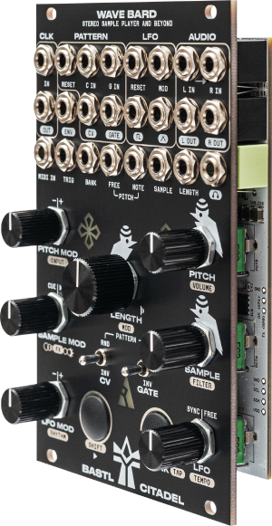
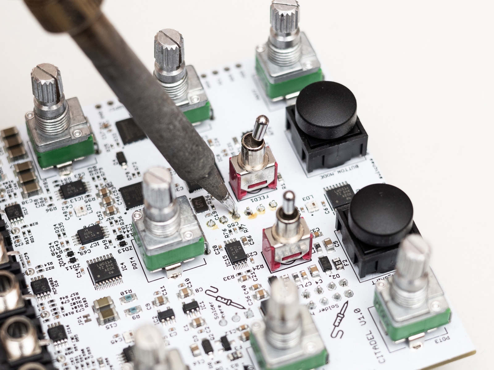
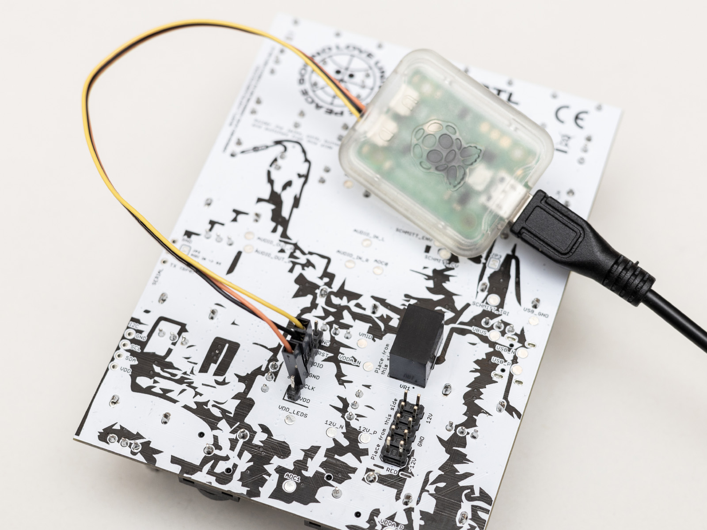

# Citadel

A Eurorack adaptation of the [Kastle 2](https://github.com/bastl-instruments/kastle2) synthesizer platform.

This repository contains schematics, panel template, and build tools. For code examples, see the Kastle 2 repository – the code is compatible with both platforms.

## Developing using Citadel

Refer to the [Kastle 2 Toolchain Install Guide](https://github.com/bastl-instruments/kastle2/blob/main/TOOLCHAIN_INSTALL.md) for the complete instructions how to develop using the Kastle 2 / Citadel platform.

### Soldering the connector

> [!WARNING]
> Soldering the connector and other board modification void the official warranty and you do it at your own risk.

### Attaching the Raspberry Pi Debug Probe

## Credits

**Citadel developed by**   
Martin Klecl ([@martinklecl](https://github.com/martinklecl)), Václav Mach ([@xx0x](https://github.com/xx0x))

**Supervised by**  
Václav Peloušek ([@vaclav-bastl](https://github.com/vaclav-bastl))

## License

**Schematics, Documentation, Templates, Printable 3D files**  
CC BY SA 4.0 license